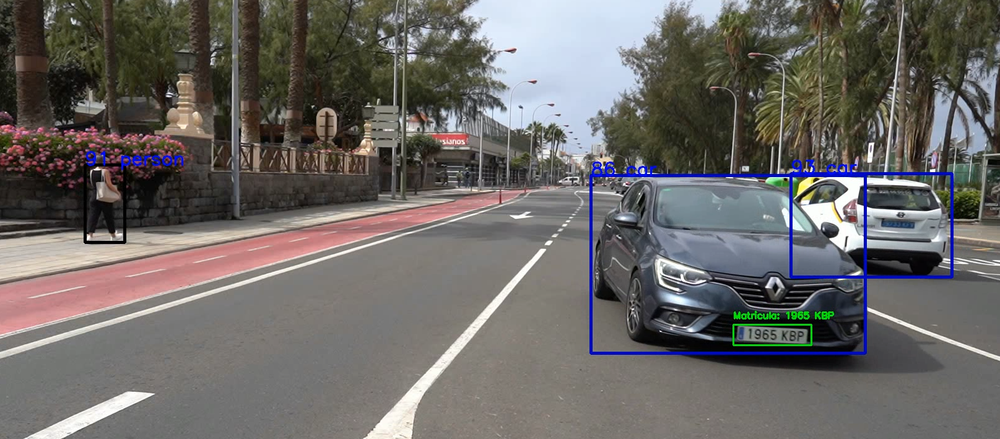
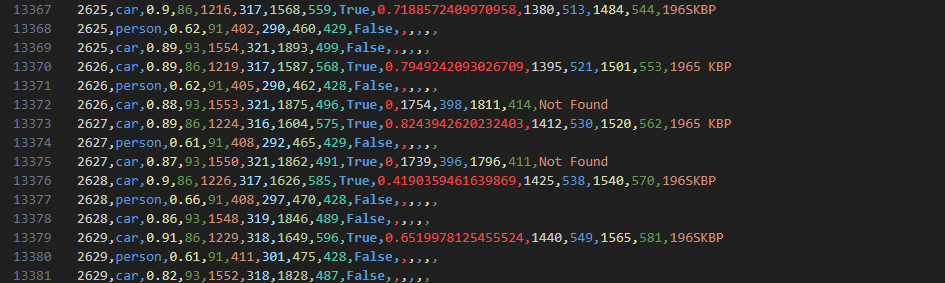

# Práctica 4: Detección de Matrículas con YOLO y EasyOCR

## Asignatura: Visión por Computador

### Autores:

- Pablo Segura López
- Kilian Armas Pérez

### Descripción de la Práctica

En esta práctica se ha desarrollado un sistema de **detección y reconocimiento de matrículas** en imágenes y vídeo. Para lograrlo, se han integrado dos herramientas clave: el modelo YOLO (You Only Look Once) y la biblioteca EasyOCR. La combinación de estas tecnologías permite detectar rápidamente la ubicación de las matrículas en una imagen y, seguidamente, extraer el texto contenido en ellas para su posterior procesamiento.

### Estructura y Funcionamiento del Código

1. **Detección de Objetos con YOLO**:

   - YOLO es capaz de procesar tanto imágenes como secuencias de vídeo, detectando las áreas en las que se encuentran diversos objetos, como pueden ser: personas, coches, motos, guaguas, camiones, etc.
   - Además, se ha entrenado un modelo para la detección de matrículas con un dataset obtenido de RoboFlow \[1], que se utiliza en las secciones de la imagen en las que se detecta un vehículo para mayor precisión.

2. **Reconocimiento de Texto con EasyOCR**:

   - EasyOCR permite realizar el reconocimiento óptico de caracteres en las matrículas detectadas. Esta herramienta OCR es eficaz en la extracción de texto en distintas condiciones de iluminación y ruido.
   - Una vez detectadas las matrículas, EasyOCR procesa esas áreas específicas y extrae los caracteres (números y letras) presentes en ellas. El texto extraído se muestra en la imagen/vídeo junto a la etiqueta "Matrícula" por encima de la detección.
   - Cabe destacar que, para mejorar los resultados dados por EasyOCR, intentamos utilizar Canny y otras técnicas para preprocesar la imagen, pero no tuvieron buenos resultados, por lo que lo único que se conseguía era ralentizar la ejecución de la práctica y complicar el código sin motivo. La única técnica que mejoró los resultados dados en la práctica (y es la única técnica que se utiliza como preprocesado en la versión final de la práctica), es el reescalado de la imagen de entrada a EasyOCR, duplicando su tamaño.
   - Además, en la elección del texto de la matrícula entre los distintos fotogramas, se ha tenido en cuenta la longitud de la cadena y confianza de la detección.
     ```
     if len(predicted_license) >= 3:
         possible_licenses_confs[track_id][predicted_license] = confidence if confidence else 0
     else:
         possible_licenses_confs[track_id][predicted_license] = 0
     most_possible_text = max(possible_licenses_confs[track_id], key=possible_licenses_confs[track_id].get)
     ```

3. **Registro de los Datos en CSV**:

   - Se genera un archivo .csv que muestra para cada predicción de cada frame la siguiente estructura de datos:

   ```
   # Inicialización de CSV
   with open('resultados.csv', mode='w', newline='') as csv_file:
      fieldnames = [
         'fotograma', 'tipo_objeto', 'confianza', 'identificador_tracking',
         'x1', 'y1', 'x2', 'y2', 'matrícula', 'confianza_matrícula',
         'mx1', 'my1', 'mx2', 'my2', 'texto_matrícula'
      ]
   writer = csv.DictWriter(csv_file, fieldnames=fieldnames)
   writer.writeheader()
   frame_number = 0  # Contador de fotogramas
   ```

### Observaciones

El modelo entrenado de detección de matrícula funciona considerablemente bien, pero los resultados no son tan óptimos en el reconocimiento del texto de las matrículas. A pesar de esto, en algunos casos puntuales, devuelve patrones muy similares al texto original o, incluso, llegando en algunas ocasiones a reconocer por completo la matrícula, como ocurre en la siguiente imagen.



Algunos de los valores registrados para este vehículo son los siguientes:



Como se puede ver en la imagen anterior, el modelo comienza detectando un patrón similar al texto original de la matrícula y luego reconoce la matrícula correctamente, incluyendo el espacio entre los caracteres numéricos y las letras finales (1965 KBP).

Además, se ha implementado una variable booleana que indica el comportamiento del código en su ejecución:

- Si la variable _display_ posee un valor "True", indica que el vídeo se mostrará por pantalla.
- Mientras que si la variable _display_ es igual a "False", indica que el vídeo se generará en formato .avi para su posterior reproducción, junto con un archivo .csv que se ha descrito en el apartado anterior.

```
# Variable booleana que indica si quieres guardar en memoria (False) o visualizar en pantalla (True)
display = False
```

El vídeo que se obtiene como resultado de la ejecución de esta práctica se puede visualizar desde el siguiente enlace:

[](https://youtu.be/H7vOkikLQaw)

<p><a href="https://youtu.be/H7vOkikLQaw" target="_blank">https://youtu.be/H7vOkikLQaw</a></p>

### Fuentes

\[1]: https://universe.roboflow.com/roboflow-universe-projects/license-plate-recognition-rxg4e/dataset/8
